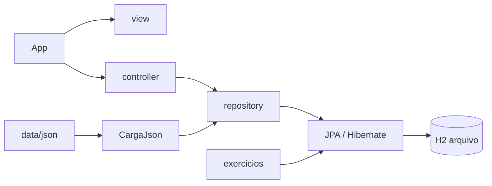

# Aula 11 — JPA e Hibernate

Laboratório da FIAP / Arquitetura Caixa para persistir objetos Java no H2, no estilo **MVC**.

Rode só o `App`. Ele sobe o H2, abre o console web e mostra o catálogo de exercícios. Não há menu de cadastrar ou listar: a aula escolhe o exercício e, em paralelo, o navegador mostra as tabelas.

---

## Stack

| Peça | Versão | Papel |
| --- | --- | --- |
| Java | 25 | linguagem |
| Maven | 3.9+ | build e execução |
| JPA | 3.1 | API de persistência |
| Hibernate | 6.6 | provedor JPA |
| H2 | 2.3 | banco em arquivo |
| Jackson | 2.18 | leitura dos JSONs de carga |

---

## Como executar

O working directory **sempre** é a pasta deste `pom.xml`. Sem isso, o H2 e os JSONs nascem no lugar errado.

**IntelliJ:** `src/main/java/org/caixaverso/App.java` → **Run 'App.main()'**

**Terminal:**

```sh
mvn -q compile exec:java
```

Na largada o `App` faz tudo:

1. Abre `data/h2/laboratorio.mv.db`
2. Aplica `data/json` no H2 (sempre; é a fonte dos dados da aula)
3. Sobe o console H2 em [http://localhost:8082](http://localhost:8082)
4. Lista os exercícios para você escolher `1`, `2`, …

No navegador, **Connect** com a JDBC URL impressa no terminal (**não** use `jdbc:h2:~/test`):

```sql
select id, titular, saldo from conta order by id;
select id, nome, documento from pessoa order by id;
```

O `ConsoleH2` separado continua existindo, mas não é mais obrigatório na aula.

### Login do H2

| Campo | Valor |
| --- | --- |
| Endereço | http://localhost:8082 |
| JDBC URL | `jdbc:h2:file:./data/h2/laboratorio;AUTO_SERVER=TRUE` |
| Usuário | `sa` |
| Senha | *(vazia)* |
| Arquivo | `data/h2/laboratorio.mv.db` |

`AUTO_SERVER=TRUE` permite o `App`, o console H2 e o IntelliJ Database usarem o **mesmo** arquivo ao mesmo tempo.

---

## Menu do App

Só exercícios. Digite o código (`1` ou `01`) e Enter. `0` encerra o `App` e o console H2.

| Código | Classe | Ideia |
| --- | --- | --- |
| `1` | `Exercicio01ObjetoMemoria` | `new` não gera id nem grava |
| `2` | `Exercicio02ListarContasJpa` | lista contas no H2 já aberto |

---

## Arquitetura MVC

```text
org.caixaverso
├── App.java                 ← rode esta classe
├── model/                   entidades JPA
│   ├── Conta
│   └── Pessoa
├── view/                    console (menu e tabelas)
├── controller/              orquestra a ação
├── repository/              persistência
├── infra/
│   ├── h2/                  BancoH2 + ConsoleH2
│   ├── jpa/                 fábrica e transação
│   └── json/                carga de data/json
└── exercicios/              exercícios da aula
```



| Camada | Pasta | Coloque aqui |
| --- | --- | --- |
| Model | `model/` | entidade nova (`@Entity`) |
| View | `view/` | texto de tela e leitura do teclado |
| Controller | `controller/` | fluxo do menu |
| Repository | `repository/` | `persist`, `find`, JPQL |
| Infra | `infra/` | H2, JPA, JSON |
| Exercício | `exercicios/` | cenário da aula |

Depois de criar uma entidade, registre-a em `src/main/resources/META-INF/persistence.xml`.

---

## De onde vêm os dados

O Hibernate **não inventa** Ana, Caio ou Duda. A carga lê:

| Arquivo | Tabela |
| --- | --- |
| [`data/json/contas.json`](data/json/contas.json) | `conta` |
| [`data/json/pessoas.json`](data/json/pessoas.json) | `pessoa` |

- Cada execução do `App` aplica de novo `contas.json` e `pessoas.json`
- Edite o JSON, rode o `App` e o H2 já consome os novos dados
- Confira as tabelas no console H2 enquanto o exercício roda

---

## Como adicionar um exercício

Com o `App` rodando, o catálogo já está na tela. Para incluir o próximo:

1. Crie a classe em `src/main/java/org/caixaverso/exercicios/`
2. Implemente `Exercicio` (`codigo`, `titulo`, `executar`)
3. Registre em `CatalogoExercicios.todos()`
4. Rode o `App` de novo e digite o código do exercício

```java
public class Exercicio03PersistirConta implements Exercicio {
    public String codigo() { return "03"; }
    public String titulo() { return "Persistir uma conta no H2"; }

    public void executar(EntityManagerFactory fabrica) {
        // a fábrica já aponta para o H2 local do App
    }
}
```

Use o `fabrica` recebido. Não abra outra fábrica, a menos que o exercício precise de H2 em memória (`JpaFactory.abrirMemoria()`).

---

## Duas unidades JPA

| Unidade | Onde | `hbm2ddl` | Quem usa |
| --- | --- | --- | --- |
| `local` | `data/h2/laboratorio.mv.db` | `update` | `App`, exercícios no menu, console H2 |
| `laboratorio` | memória | `create-drop` | exercício isolado que some ao fechar |

---

## Problemas comuns

| Sintoma | O que fazer |
| --- | --- |
| `Table "CONTA" not found` no console | JDBC URL errada. Não use `jdbc:h2:~/test` |
| Arquivo não aparece em `data/h2` | Working directory tem que ser a pasta do `pom.xml` |
| `Database may be already in use` | Feche o outro `main` ou use a URL com `AUTO_SERVER=TRUE` |
| Console abre e a tabela está vazia | Rode o `App` antes; a unidade em memória não grava neste arquivo |
| IntelliJ não acha `org.h2` | Maven reload / Reimport |
| Porta 8082 ocupada | Pare o `ConsoleH2` anterior e rode de novo |

Para zerar a base: pare o `App` e o console H2, apague `data/h2/laboratorio.mv.db` (e `.lock.db` / `.trace.db` se existirem) e execute o `App` outra vez.

---

## Atalhos Maven

```sh
# sobe H2, console e catalogo de exercicios
mvn -q compile exec:java
```
