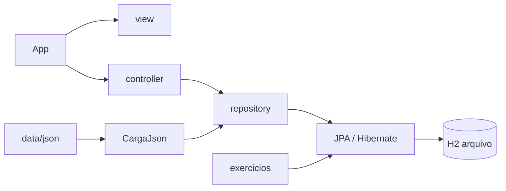

# Aula 11 — JPA e Hibernate

Laboratório da FIAP / Arquitetura Caixa para persistir objetos Java com JPA, no estilo **MVC**.

Rode só o `App`. O JSON popula as tabelas e o menu lista os exercícios. O banco padrão é H2. Na Caixa, sem Docker, dá para apontar o mesmo `App` para PostgreSQL instalado na máquina.

---

## Stack

| Peça | Versão | Papel |
| --- | --- | --- |
| Java | 25 | linguagem |
| Maven | 3.9+ | build e execução |
| JPA | 3.1 | API de persistência |
| Hibernate | 6.6 | provedor JPA |
| H2 | 2.3 | banco em arquivo (padrão da aula) |
| PostgreSQL | 16/17 | banco local sem Docker (opcional) |
| Jackson | 2.18 | leitura dos JSONs de carga |

---

## Antes de qualquer forma

1. Instale o **JDK 25** e o **Maven 3.9+**
   - Java (Temurin): https://adoptium.net/temurin/releases/?version=25
   - Maven: https://maven.apache.org/download.cgi
2. Abra o terminal **na pasta deste `pom.xml`**
3. Confira:

```sh
java -version
mvn -version
```

4. Escolha o banco em [`data/postgres/aula.properties`](data/postgres/aula.properties):

```properties
aula.banco=h2
# ou
aula.banco=postgres
```

5. Nas duas formas, rode o mesmo `App`:

```sh
mvn -q compile exec:java
```

**IntelliJ:** File → Open na pasta do `pom.xml` → abra `src/main/java/org/caixaverso/App.java` → Run `App.main()`. Working directory = pasta do `pom.xml`.

O JSON em [`data/json`](data/json) é a fonte dos dados. O `App` aplica `contas.json` e `pessoas.json` a cada execução.

---

## Forma 1 — H2 (padrão, sem instalar banco)

O motor H2 **não se instala no sistema**. O Maven baixa o JAR na primeira compilação.

Site do H2 (só referência; não precisa do ZIP): https://www.h2database.com

### O que fazer

1. Abra [`data/postgres/aula.properties`](data/postgres/aula.properties) e deixe:

```properties
aula.banco=h2
```

2. Compile e rode:

```sh
mvn -q compile exec:java
```

3. No terminal deve aparecer:
   - arquivo `data/h2/laboratorio.mv.db`
   - console `http://localhost:8082`
   - catálogo de exercícios
4. Abra o console: http://localhost:8082
5. Na tela de login, **apague** o valor padrão `jdbc:h2:~/test` e cole a URL abaixo
6. Clique em **Connect**
7. Rode o SQL e clique em **Run**

### Comandos

```sh
# na pasta do pom.xml
mvn -q compile exec:java
```

Console H2 avulso (opcional; o App já sobe):

```sh
mvn -q compile exec:java -Dexec.mainClass=org.caixaverso.infra.h2.ConsoleH2
```

SQL para ver os dados:

```sql
select id, titular, saldo from conta order by id;
select id, nome, documento from pessoa order by id;
```

### Login do H2

| Campo | O que preencher |
| --- | --- |
| Saved Settings | Generic H2 (Embedded) |
| Driver Class | `org.h2.Driver` |
| JDBC URL | `jdbc:h2:file:./data/h2/laboratorio;AUTO_SERVER=TRUE` |
| User Name | `sa` |
| Password | vazio |

Arquivo físico: `data/h2/laboratorio.mv.db`

### Zerar o H2

Com o `App` parado:

```sh
rm data/h2/laboratorio.mv.db data/h2/laboratorio.lock.db data/h2/laboratorio.trace.db
```

No Windows (PowerShell):

```powershell
Remove-Item data\h2\laboratorio.mv.db, data\h2\laboratorio.lock.db, data\h2\laboratorio.trace.db -ErrorAction SilentlyContinue
```

---

## Forma 2 — PostgreSQL na máquina (sem Docker)

Não use container e não use base corporativa da Caixa. Instale o servidor local, crie o banco `aula11` e aponte o `App`.

Links oficiais:

- Downloads: https://www.postgresql.org/download/
- Mac: https://www.postgresql.org/download/macosx/
- Windows: https://www.postgresql.org/download/windows/
- Instalador EDB (Windows/Mac): https://www.enterprisedb.com/downloads/postgres-postgresql-downloads
- Documentação `psql`: https://www.postgresql.org/docs/current/app-psql.html

### Passo comum (Mac e Windows)

1. Instale o PostgreSQL (veja 2.1 ou 2.2 abaixo) e deixe o serviço rodando na porta `5432`
2. Na pasta do `pom.xml`, crie o banco da aula:

```sh
# Mac (usuario da sua conta)
psql -d postgres -f data/postgres/criar-banco.sql

# Windows (usuario postgres da instalacao)
psql -U postgres -f data/postgres/criar-banco.sql
```

3. Abra [`data/postgres/aula.properties`](data/postgres/aula.properties) e troque:

```properties
aula.banco=postgres
postgres.host=localhost
postgres.port=5432
postgres.database=aula11
postgres.user=aula
postgres.password=aula
```

4. Rode o `App`:

```sh
mvn -q compile exec:java
```

5. Confira no `psql` ou no pgAdmin (não no console H2):

```sh
psql -h localhost -U aula -d aula11 -c "select id, titular, saldo from conta order by id;"
psql -h localhost -U aula -d aula11 -c "select id, nome, documento from pessoa order by id;"
```

Senha pedida pelo `psql`: `aula`

| Campo | Valor |
| --- | --- |
| Host | `localhost` |
| Porta | `5432` |
| Banco | `aula11` |
| Usuário | `aula` |
| Senha | `aula` |
| JDBC | `jdbc:postgresql://localhost:5432/aula11` |

Script do banco: [`data/postgres/criar-banco.sql`](data/postgres/criar-banco.sql)

### 2.1 Mac (Homebrew)

Homebrew: https://brew.sh  
Fórmula: https://formulae.brew.sh/formula/postgresql@17

Se a porta `5432` já estiver ocupada (muitas vezes por Docker), pare o container antes:

```sh
docker ps --filter publish=5432
docker stop NOME_OU_ID_DO_CONTAINER
```

Instale e ligue o servidor (não é só o cliente `psql`):

```sh
brew install postgresql@17
echo 'export PATH="/opt/homebrew/opt/postgresql@17/bin:$PATH"' >> ~/.zshrc
source ~/.zshrc
brew services start postgresql@17
```

Confira:

```sh
psql --version
pg_isready
brew services list
```

Crie o banco (superusuário = seu usuário do Mac, em geral sem senha no socket):

```sh
cd pasta-deste-projeto   # onde está o pom.xml
psql -d postgres -f data/postgres/criar-banco.sql
```

Se `CREATE USER` / `CREATE DATABASE` falhar porque já existem:

```sh
dropdb aula11
dropuser aula
psql -d postgres -f data/postgres/criar-banco.sql
```

Ligue o projeto e rode:

```sh
# em data/postgres/aula.properties → aula.banco=postgres
mvn -q compile exec:java
```

Para parar / iniciar o serviço depois:

```sh
brew services stop postgresql@17
brew services start postgresql@17
```

### 2.2 Windows / laboratório da Caixa

1. Baixe o instalador: https://www.enterprisedb.com/downloads/postgres-postgresql-downloads (escolha 16 ou 17, Windows x86-64)
2. Na Caixa, se a internet estiver bloqueada, use o pacote do **catálogo interno**
3. No assistente:
   - instale o servidor e o **pgAdmin 4**
   - porta `5432`
   - anote a senha do usuário `postgres`
   - deixe o serviço Windows iniciado
4. Confirme o serviço: `services.msc` → **postgresql-x64-16** (ou 17) → Status Running
5. Abra o PowerShell na pasta do `pom.xml` e rode:

```powershell
psql -U postgres -f data\postgres\criar-banco.sql
```

Se `psql` não for reconhecido:

```powershell
& "C:\Program Files\PostgreSQL\16\bin\psql.exe" -U postgres -f data\postgres\criar-banco.sql
```

6. Em `data\postgres\aula.properties` coloque `aula.banco=postgres`
7. Rode:

```powershell
mvn -q compile exec:java
```

8. No **pgAdmin 4**:
   - Servers → PostgreSQL → Databases → `aula11`
   - Query Tool
   - cole:

```sql
select id, titular, saldo from conta order by id;
select id, nome, documento from pessoa order by id;
```

pgAdmin (documentação): https://www.pgadmin.org/docs/

---

## Menu do App

Só exercícios. Digite o código (`1` ou `01`) e Enter. `0` encerra o `App` e o console H2.

| Código | Classe | Ideia |
| --- | --- | --- |
| `1` | `Exercicio01ObjetoMemoria` | `new` não gera id nem grava |
| `2` | `Exercicio02ListarContasJpa` | lista contas no H2 já aberto |

---

## Arquitetura MVC

```text
org.caixaverso
├── App.java                 ← rode esta classe
├── model/                   entidades JPA
│   ├── Conta
│   └── Pessoa
├── view/                    console (menu e tabelas)
├── controller/              orquestra a ação
├── repository/              persistência
├── infra/
│   ├── h2/                  BancoH2 + ConsoleH2
│   ├── jpa/                 fábrica e transação
│   └── json/                carga de data/json
└── exercicios/              exercícios da aula
```



| Camada | Pasta | Coloque aqui |
| --- | --- | --- |
| Model | `model/` | entidade nova (`@Entity`) |
| View | `view/` | texto de tela e leitura do teclado |
| Controller | `controller/` | fluxo do menu |
| Repository | `repository/` | `persist`, `find`, JPQL |
| Infra | `infra/` | H2, JPA, JSON |
| Exercício | `exercicios/` | cenário da aula |

Depois de criar uma entidade, registre-a em `src/main/resources/META-INF/persistence.xml`.

---

## De onde vêm os dados

O Hibernate **não inventa** Ana, Caio ou Duda. A carga lê:

| Arquivo | Tabela |
| --- | --- |
| [`data/json/contas.json`](data/json/contas.json) | `conta` |
| [`data/json/pessoas.json`](data/json/pessoas.json) | `pessoa` |

- Cada execução do `App` aplica de novo `contas.json` e `pessoas.json`
- Edite o JSON, rode o `App` e o banco escolhido (H2 ou Postgres) já consome os novos dados
- H2: console em http://localhost:8082 — Postgres: pgAdmin ou `psql`

---

## Como adicionar um exercício

Com o `App` rodando, o catálogo já está na tela. Para incluir o próximo:

1. Crie a classe em `src/main/java/org/caixaverso/exercicios/`
2. Implemente `Exercicio` (`codigo`, `titulo`, `executar`)
3. Registre em `CatalogoExercicios.todos()`
4. Rode o `App` de novo e digite o código do exercício

```java
public class Exercicio03PersistirConta implements Exercicio {
    public String codigo() { return "03"; }
    public String titulo() { return "Persistir uma conta no H2"; }

    public void executar(EntityManagerFactory fabrica) {
        // a fábrica já aponta para o H2 local do App
    }
}
```

Use o `fabrica` recebido. Não abra outra fábrica, a menos que o exercício precise de H2 em memória (`JpaFactory.abrirMemoria()`).

---

## Duas unidades JPA

| Unidade | Onde | `hbm2ddl` | Quem usa |
| --- | --- | --- | --- |
| `local` | `data/h2/laboratorio.mv.db` | `update` | `App` com `aula.banco=h2` |
| `postgres` | `localhost:5432/aula11` | `update` | `App` com `aula.banco=postgres` |
| `laboratorio` | memória | `create-drop` | exercício isolado que some ao fechar |

---

## Problemas comuns

| Sintoma | O que fazer |
| --- | --- |
| `Table "CONTA" not found` no console | JDBC URL errada. Não use `jdbc:h2:~/test` |
| Arquivo não aparece em `data/h2` | Working directory tem que ser a pasta do `pom.xml` |
| `Database may be already in use` | Feche o outro `main` ou use a URL com `AUTO_SERVER=TRUE` |
| Console abre e a tabela está vazia | Rode o `App` antes; a unidade em memória não grava neste arquivo |
| IntelliJ não acha `org.h2` | Maven reload / Reimport |
| Porta 8082 ocupada | Pare o `ConsoleH2` anterior e rode de novo |
| `Connection refused` no Postgres | Serviço PostgreSQL parado ou porta diferente de 5432 |
| `password authentication failed` | Usuario/senha de `aula.properties` diferentes do `criar-banco.sql` |
| `database "aula11" does not exist` | Rode `data/postgres/criar-banco.sql` |

Para zerar a base: pare o `App` e o console H2, apague `data/h2/laboratorio.mv.db` (e `.lock.db` / `.trace.db` se existirem) e execute o `App` outra vez.

---

## Atalhos Maven

```sh
# sobe H2, console e catalogo de exercicios
mvn -q compile exec:java
```
